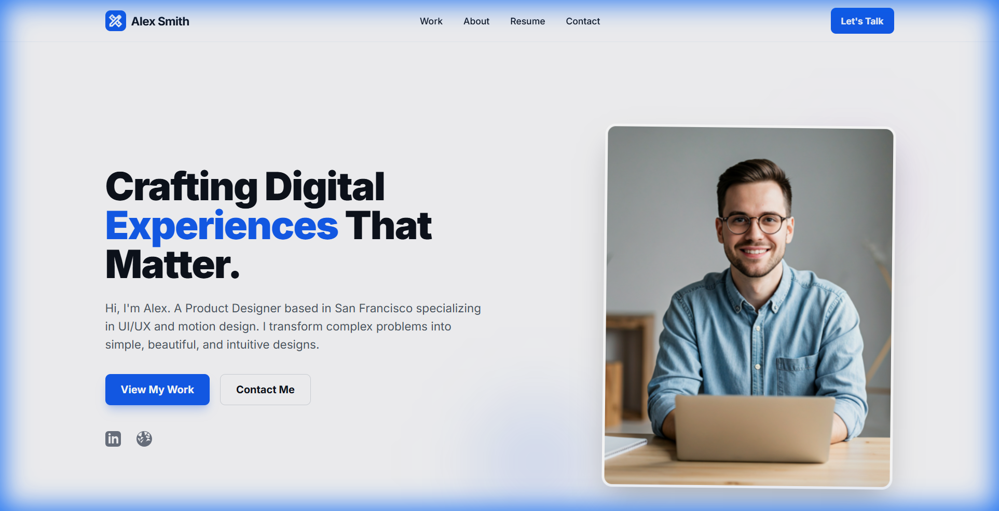
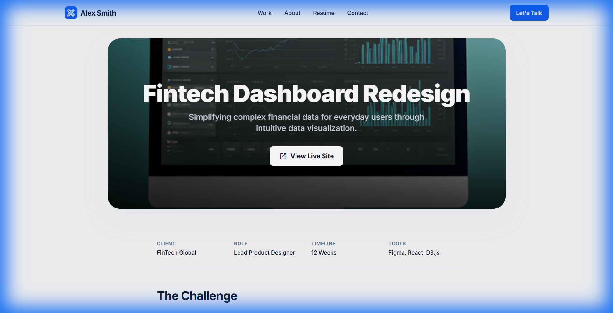
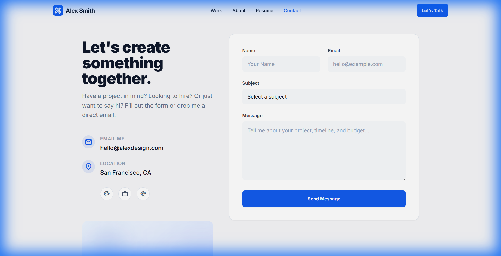

# Professional Portfolio Website

A modern, responsive portfolio website built with React, TypeScript, Vite, and Tailwind CSS. This project showcases my work as a Product Designer, featuring a clean aesthetic, dark mode support, and smooth client-side routing.

## 🚀 Features

-   **Modern Tech Stack**: Built with React 18, TypeScript, and Vite for lightning-fast performance.
-   **Responsive Design**: Mobile-first approach ensuring a seamless experience across all devices.
-   **Dark Mode**: Native dark mode support using Tailwind CSS.
-   **Component-Based**: Reusable components for consistent styling and maintainability.
-   **Client-Side Routing**: Smooth page transitions with `react-router-dom`.
-   **Interactive Elements**: Hover effects, micro-animations, and interactive project cards.

## 🛠️ Tech Stack

-   **Frontend Framework**: React
-   **Language**: TypeScript
-   **Build Tool**: Vite
-   **Styling**: Tailwind CSS (v3)
-   **Routing**: React Router DOM
-   **Icons**: Material Symbols Outlined

## 📸 Screenshots

### Home Page
The landing page featuring a hero section, expertise highlights, and recent work.


### About Page
A detailed "About Me" section with my journey, philosophy, experience timeline, and skills.


### Projects Page
A gallery of selected works with category filtering.


### Project Details
An in-depth case study view for individual projects.


### Contact Page
A functional contact form and social links.


## 🏃‍♂️ How to Run Locally

1.  **Clone the repository:**
    ```bash
    git clone https://github.com/HemanthKumar817/Portfolio-1.git
    cd Portfolio-1
    ```

2.  **Install dependencies:**
    ```bash
    npm install
    ```

3.  **Start the development server:**
    ```bash
    npm run dev
    ```

4.  **Open your browser:**
    Navigate to `http://localhost:5173` to view the application.

## 📦 Build for Production

To create a production-ready build:

```bash
npm run build
```

This will generate static files in the `dist` directory, ready to be deployed to any static hosting service (Netlify, Vercel, GitHub Pages, etc.).

## 📄 License

This project is open-source and available under the [MIT License](LICENSE).
